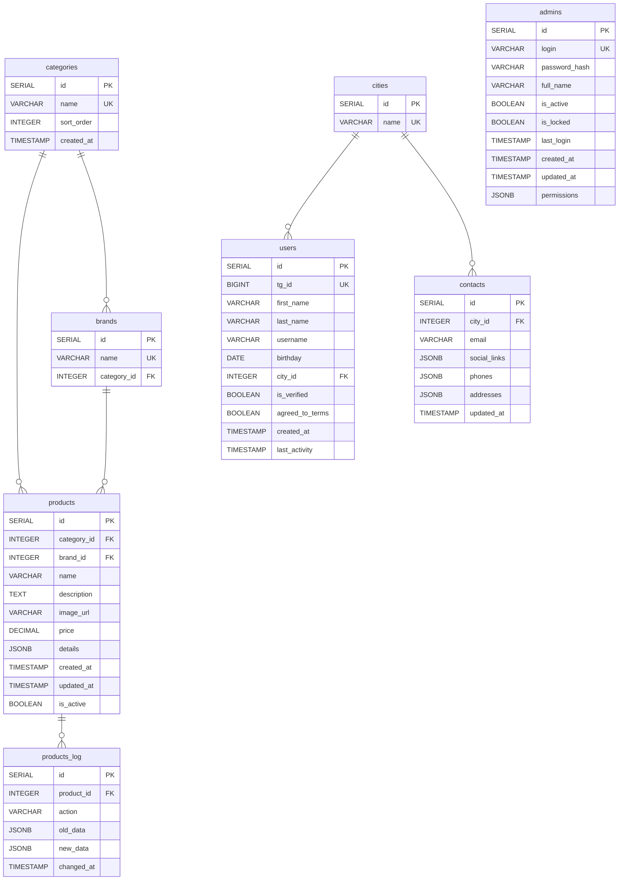
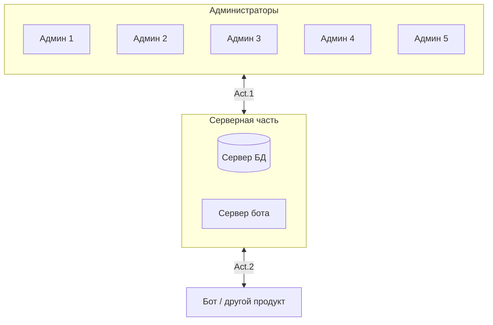
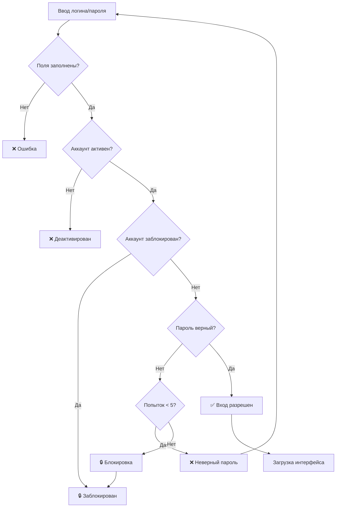

# Диаграммы

## Диаграмма базы данных

 

## Логика взаимодействий

### Act. 1 - Взимодействие "Админ <-> Сервер"

1. Взимодействие происходит от имени администратора (таблица admins), ведется логирование.
  
2. Доступы настроены в формате JSON, так же ограничение внутри базы данных через GRANT.

3. Уровень взаимодействия - полный (Просмотр, внесение, удаление, изменение)

### Act. 2 - Взаимодействие "Сервер <-> Бот"

1. Взаимодействие присходит от лица Bot_user (Создание пользователя внутри базы данных, ограничение исключительно на GRANT SELECT (только просмотр))

2. Уровень взаимодействия - низкий

   Бот -> Cервер: исключительно SELECT;

   Сервер -> Бот: Полное предоставление данных для просмотра

 

## Описание взаимодействий

Админ -> (SELECT, INSERT, DELETE, UPDATE) ->

База данных -> (GRANT SELECT) ->

Бот -> (GRANT SELECT) ->

Конечный пользователь

 

## Определение доступа к программе и её функционалу

